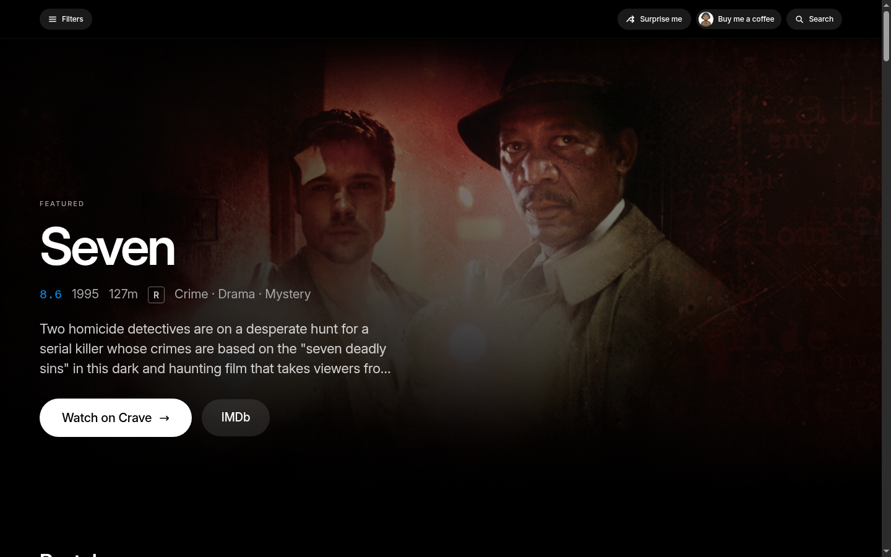
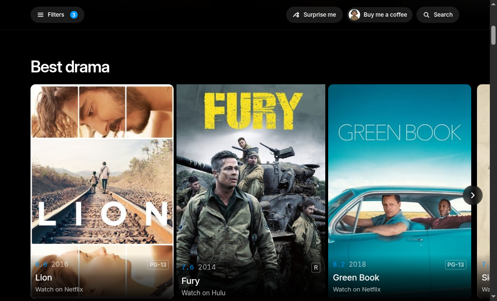
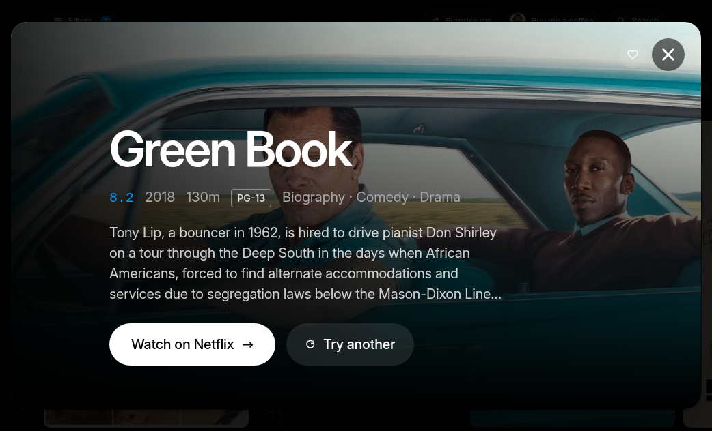
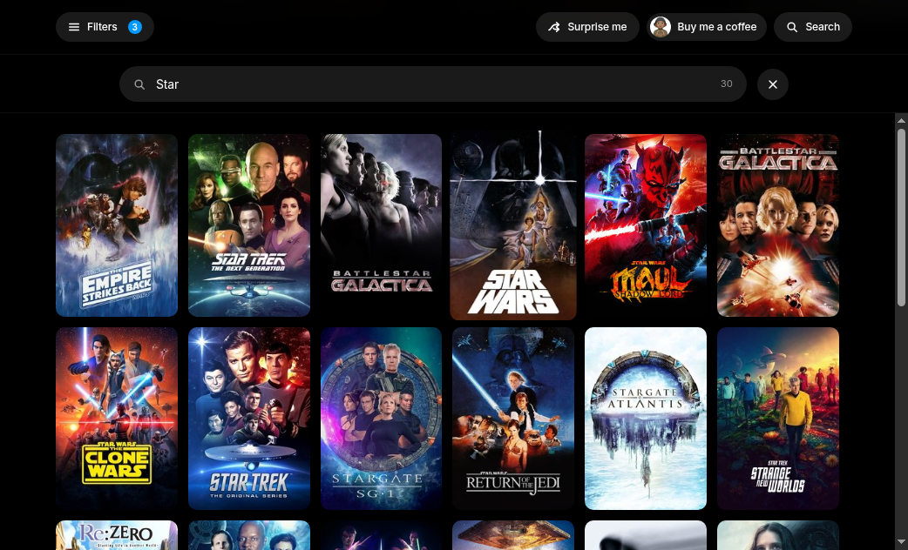
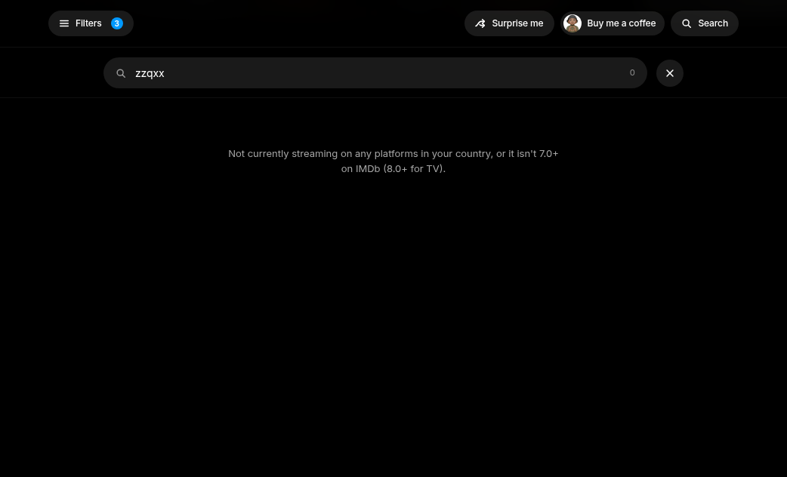
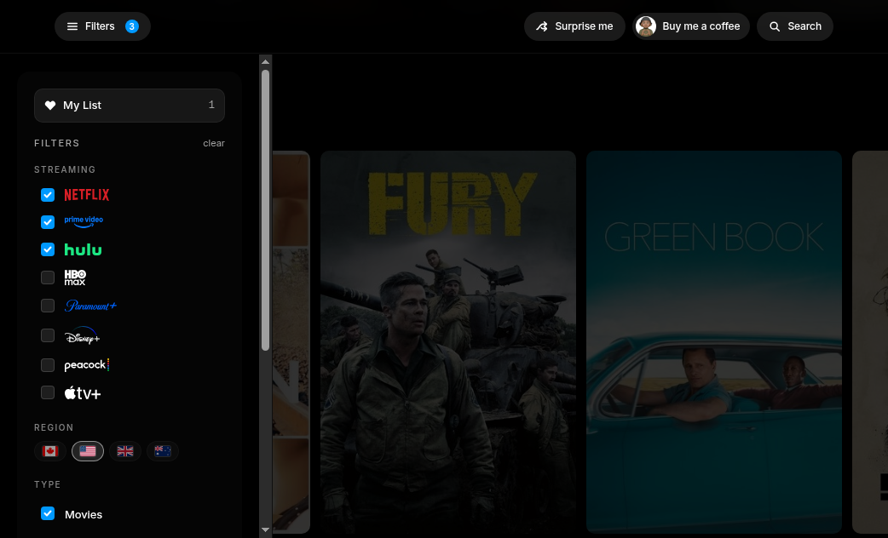
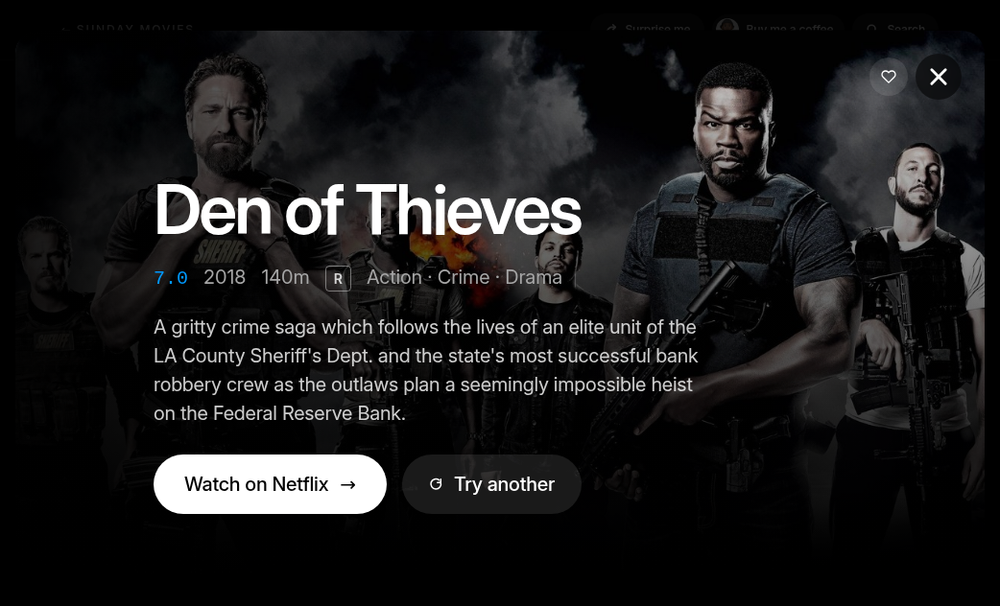
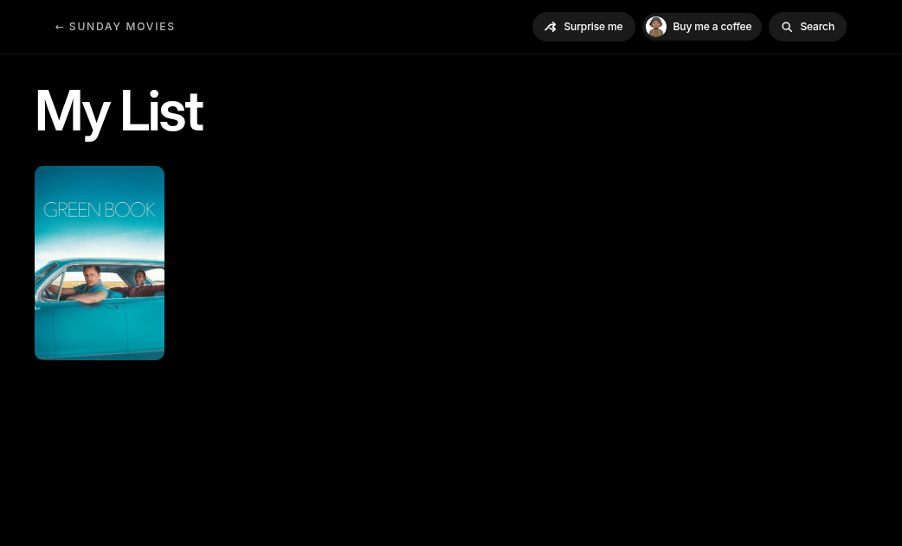
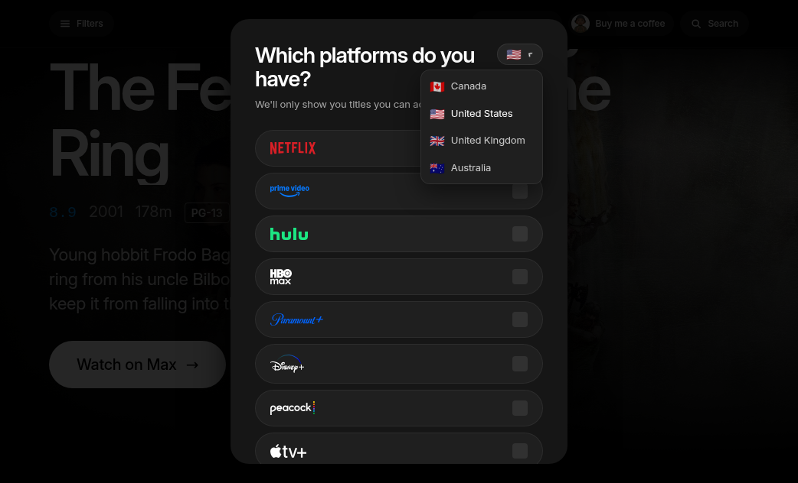

# sunday movies

Top-rated movies and TV, filtered to what is actually streaming in your country.

[Website](https://sundaymovies.io) · Next.js · Canada, US, UK, Australia · No account

## Home

The hero rotates among the top 25. Watch on [service], plus IMDb.

<p align="center"></p>

## Rails

Best {genre}. Best of the 2020s, the 2010s, the 90s. View all goes to `/c/[slug]` and keeps your filters in the URL.

<p align="center"></p>

## Title card

Rating, year, runtime, cert, genres, synopsis. Watch on [service]. Save heart. Try another. Routes like `/m/tt6966692`.

<p align="center"></p>

## Search

Type 2+ characters. If nothing hits:

> Not currently streaming on any platforms in your country, or it isn't 7.0+ on IMDb (8.0+ for TV).

<p align="center"></p>

<p align="center"></p>

## Filters

Services, region flags, Movies/TV, certs. English-only is the default. Onboarding asks which platforms you have. The catalog re-ranks to those services.

<p align="center"></p>

## Surprise me

A random pick from the filtered set. Try another rerolls.

<p align="center"></p>

## My List

A local watchlist. No account. `/list`.

<p align="center"></p>

## Regions

CA, US, GB, AU. Geo comes from the Vercel country header. A cookie overrides it.

<p align="center"></p>

The catalog is IMDb ≥ 7.0 for movies, ≥ 8.0 for TV, ≥ 25k votes, then TMDB flatrate. Runtime does not call TMDB or JustWatch. The catalogs are committed JSON.

## Run it

```
npm i && npm run dev
```

Catalogs are already in `public/`. Keys are only needed for `npm run refresh:all`.

## What's in here

```
app/                 Next.js app
lib/                 region, catalog, watchlist
public/              catalogs, logos, flags
scripts/             refresh + verify
docs/screenshots/    the shots in this README
```

## Credits

This product uses the TMDB API but is not endorsed or certified by TMDB. IMDb data is from the non-commercial dataset. Not affiliated with Netflix, Prime Video, Disney+, or any other streamer.

## License

All rights reserved. The app is the product. Ask before you ship a copy of it.
